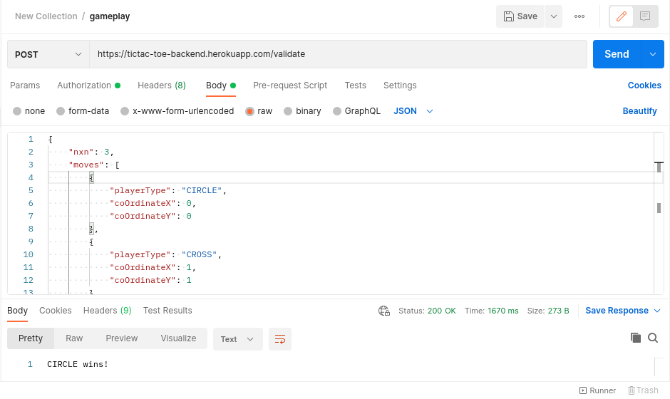
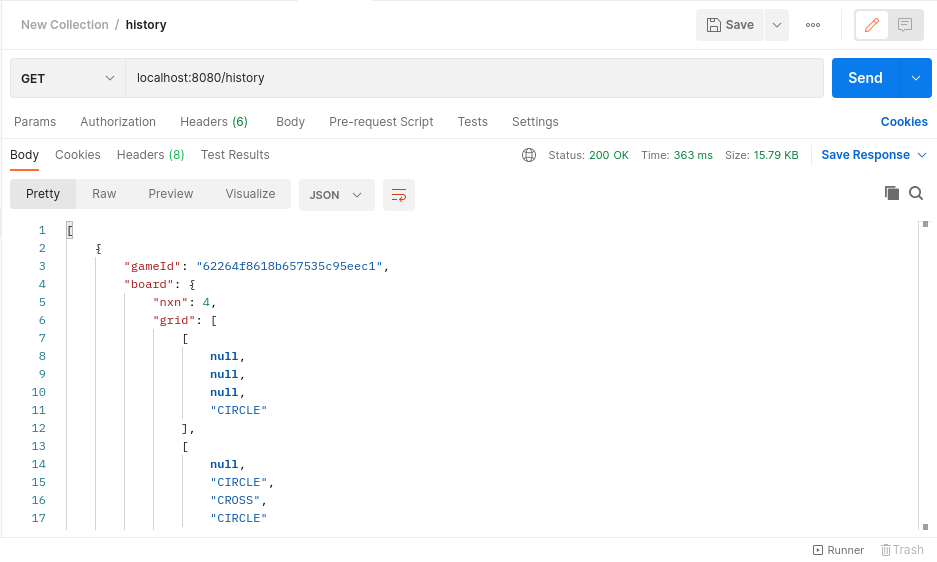
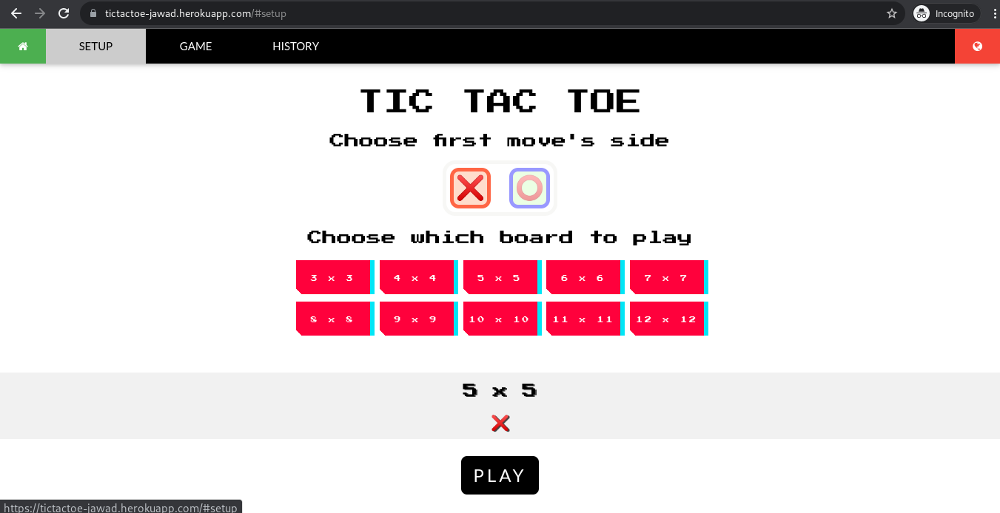
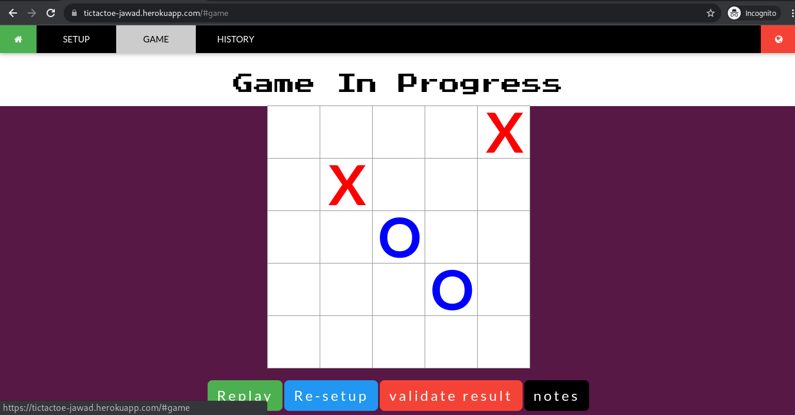
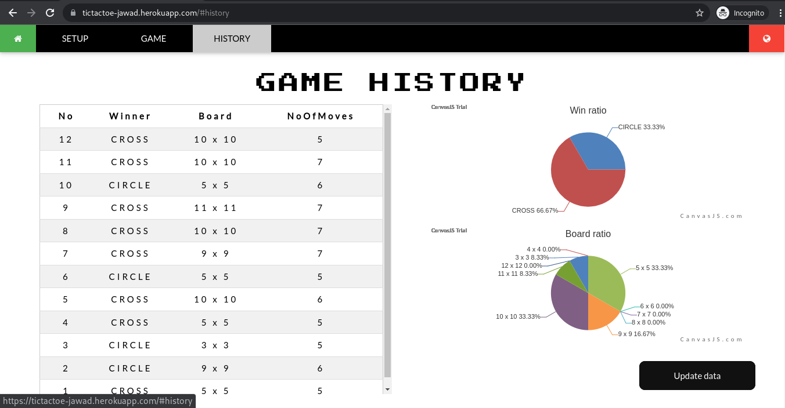
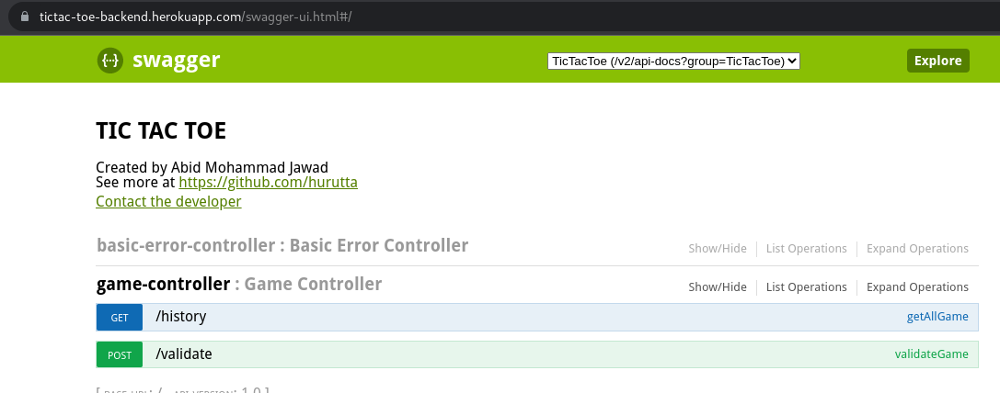
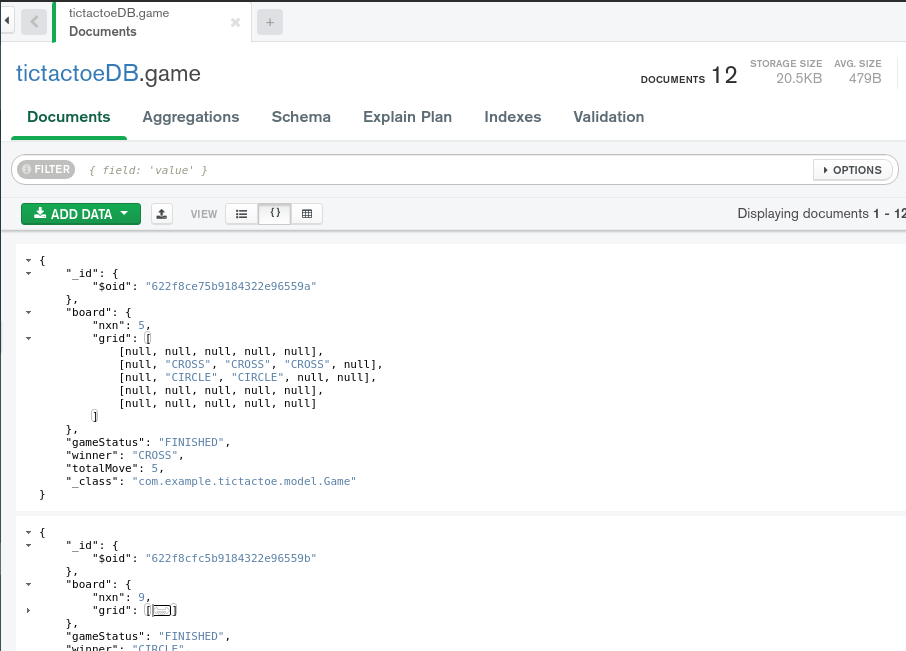
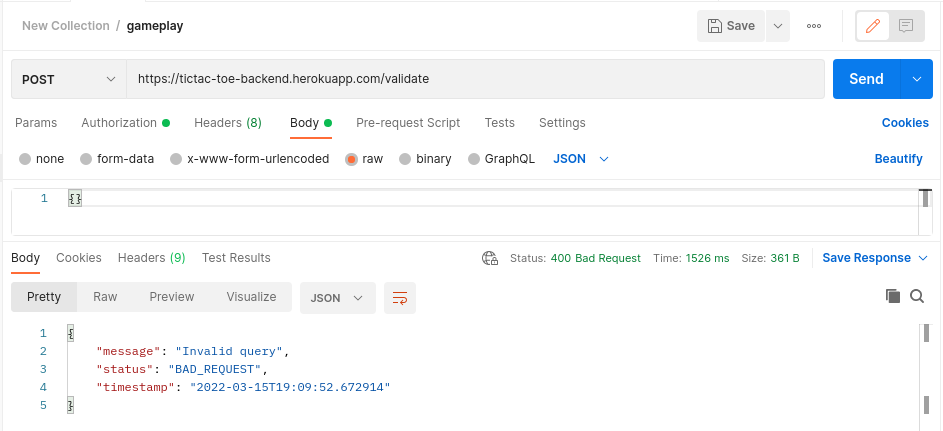

# Tic-Tac-Toe
  
Its a full-stack tic-tac-toe application with Maven based **SpringBoot** backend and **Node-js** frontend using **Express-js** framework. This app is integrated with **Swagger** , tested with **Junit** and **MongoDB** is used for database. SpringBoot serves **REST** services so that frontend part can communicate. I depolyed this full stack project on Heroku so I suggest to take a look directly - https://tictactoe-jawad.herokuapp.com/


*** 
<div id="top"></div>

<!-- TABLE OF CONTENTS -->

## Table of Contents

  <ol>
    <li>
      <a href="#about2">About The Project</a>
      <ul>
        <li><a href="#build3">Structure</a></li>
      </ul>
    </li>
    <li><a href="#usage2">Usage</a>
        <ul>
        <li><a href="#backendUsage">Back-end usage</a></li>
        <li><a href="#frontendUsage">Front-end usage</a></li>
      </ul>
    </li>
    <li><a href="#features">Features</a></li>
    <li><a href="#contact2">Contact</a></li>
  </ol>


***
<div id="about2"></div>


<!-- ABOUT THE PROJECT -->

## About The Project

In this project, I created a fullstack project for <b>N x N</b> Tic-tac-toe application where <i>3 ≤ <b>n</b> ≤ 12</i>. The frontend and backend are developed independently, with the frontend responsible for I/O and style and the backend responsible for functionality and logics. The backend is RESTful. The frontend makes API requests to the backend and receives payload. All the API shown <a href="#usage2">here</a> and in <a href="#features">swagger</a> integration part. Backend keeps all the sucessful validation result in the database, I've used mongoDB atlas microservice which is <a href="backend/src/main/java/com/example/tictactoe/config/MongoDbConfig.java">configured</a> from backend. Later, I added unit testing with Junit and Mockito.

<br>

It is designed in such a way that two players can play tic-tac-toe from the same endpoint. There is a <b>validation</b> button that allows you to verify the verdict. When the validation button is pressed, the frontend sends a <b>POST</b> API request to the backend with all the commands of moves played up to that point in a single <b>chunk</b>. The backend serves results to the frontend. If the game ends in a tie or a win, the frontend will <b>stop</b> accepting input on the board for that particular game. If the game is not finished (further moves are required for determination), the player can still give his move on the board, and continue the game. During a game, players can ask for validation multiple times by pressing the validate button if the game is not finished.

<br>

At level 2, tweaking the standard rules actually decreases the likelihood of a draw. It can be proved that when <b>n ≥ 4</b>, and matching <b>three</b> consecutive equivalent signs is the game rule, the first mover will always win if he plays optimally. The technique is that the first mover will choose any non-edged cell first. Whichever move the second player makes, the first player will then choose any neighboring cell of the first move which is also a non-edged one. This way, the first mover will always win, effectively eliminating the possibility of a tie. Additionally, it can be demonstrated that even if players move randomly, they can still reduce the probability of drawing. However, if the game rule is to match consecutive same signs on an <b>N x N</b> board is <b>N</b>, in that case it will increase probability of drawing while increasing the <b>N</b>.

<p align="right">(<a href="#top">back to top</a>)</p>

***
<div id="build3"></div>

## Structure
  
* ### Dependency
  * **Backend** 
    Dependecy imported and used for SpringBoot framework -
    * Spring Data MongoDB
    * Spring Web
    * Spring Boot DevTools
    * Junit
    * Springfox-swagger
  * **Frontend** 
    Dependecies used in Node.js -
    * Axios
    * Express.js
    * Confetti.js
* ### Directory
  *  <details><summary>
	  <b>Backend</b><br>  
      </summary>

      ```
      .
      ├── src/
      │   ├── main/
      │   │   ├── java/com/example/tictactoe/
      │   │   │   ├── config/
      │   │   │   │   ├── MongoDbConfig.java
      │   │   │   │   └── SwaggerConfig.java
      │   │   │   ├── controller/
      │   │   │   │   └── GameController.java
      │   │   │   ├── exception/
      │   │   │   │   ├── ExceptionPayload.java
      │   │   │   │   ├── GameExceptionHandler.java
      │   │   │   │   └── QueryException.java
      │   │   │   ├── model/
      │   │   │   │   ├── Board.java
      │   │   │   │   ├── Game.java
      │   │   │   │   ├── GameStatus.java
      │   │   │   │   ├── Move.java
      │   │   │   │   ├── PlayerType.java
      │   │   │   │   └── Query.java
      │   │   │   ├── repository/
      │   │   │   │   └── GameRepository.java
      │   │   │   ├── service/
      │   │   │   │   ├── GameService.java
      │   │   │   │   ├── GameServiceImpl.java
      │   │   │   │   └── VerdictService.java
      │   │   │   ├── RestServiceCorsApplication.java
      │   │   │   └── TicTacToeApplication.java
      │   │   └── resources/
      │   │       └── application.properties
      │   └── test/java/com/example/tictactoe/
      │       ├── GameUserServiceTest.java
      │       └── TicTacToeApplicationTests.java 
      └── pom.xml

      ```

    </details>

  *  <details><summary>
	  <b>Frontend</b><br>  
      </summary>
	    
      ```
      .
      ├── Procfile
      ├── public/
      │   ├── index.html
      │   ├── main.js
      │   └── main.css
      ├── server.js
      └── package.json
      ```

      </details>


<p align="right">(<a href="#top">back to top</a>)</p> 

***
<div id="build2"></div>


<div id="usage2"></div>


<!-- USAGE EXAMPLES -->
## Usage

<div id="backendUsage"></div>


### <ins>Backend end-points -</ins> 
<b>Dropdown</b> to see images of usage. 
<details>
<summary>
	Validating any query, <b>POST</b> : <a href="https://tictac-toe-backend.herokuapp.com/validate">https://tictac-toe-backend.herokuapp.com/validate</a> <br>  
	Sample JSON for this request: <b>🔻expand🔻</b>

	{
      "nxn": 4,
      "moves": 
        [
          {
              "playerType": "CIRCLE","coOrdinateX": 0,"coOrdinateY": 0
          },
          {
              "playerType": "CROSS","coOrdinateX": 1,"coOrdinateY": 1
          }      
        ]
    }

</summary>
	
</details>


<details>
<summary>
	Getting all match details, <b>GET</b> : <a href="https://tictac-toe-backend.herokuapp.com/history">https://tictac-toe-backend.herokuapp.com/history </a><b>🔻expand🔻</b> <br> 

</summary>
	
</details>
<br>

<div id="frontendUsage"></div>


### <ins>Front-end views -</ins> 
<b>Dropdown</b> to see images of usage. 


<details>
<summary>
	Front page view : <a href="https://tictactoe-jawad.herokuapp.com/">https://tictactoe-jawad.herokuapp.com/</a> <b>🔻expand🔻</b><br>  
		
</summary>
	
</details>

<details>
<summary>
	After setup the game in front page, game page view : <a href="https://tictactoe-jawad.herokuapp.com/#game">https://tictactoe-jawad.herokuapp.com/#game</a><b>🔻expand🔻</b> <br>  
		
</summary>
	
</details>

<details>
<summary>
	Game history : <a href="https://tictactoe-jawad.herokuapp.com/#history">https://tictactoe-jawad.herokuapp.com/#history</a><b>🔻expand🔻</b> <br>  
		
</summary>
	
</details>


<p align="right">(<a href="#top">back to top</a>)</p>


***
<div id="features"></div>


## Features

<details>
<summary>
	Swagger is integrated and can be access at : <a href="https://tictac-toe-backend.herokuapp.com/swagger-ui.html">https://tictac-toe-backend.herokuapp.com/swagger-ui.html</a><b>🔻expand🔻</b> <br>  
		
</summary>
	
</details>

<details>
<summary>
	View of the database, using mongoDB compass : <b>🔻expand🔻</b> <br>  	
</summary>
	
</details>

<details>
<summary>
	Custom exceptions are handled, which returns json payload with proper info without server side crash <b>🔻expand🔻</b> <br>  
		
</summary>
	
</details>

<details>
<summary>
	Tests are included, which can be found <a href="backend/src/test/java/com/example/tictactoe/GameUserServiceTest.java">here</a>.  
		
</summary>
</details>


<p align="right">(<a href="#top">back to top</a>)</p>


<div id="contact2"></div>


<!-- CONTACT -->
## Contact

You may contact with me via mail if needed. All necessary contact info are given at - <a href="https://hurutta.github.io"> my website. <a>


<p align="right">(<a href="#top">back to top</a>)</p>

